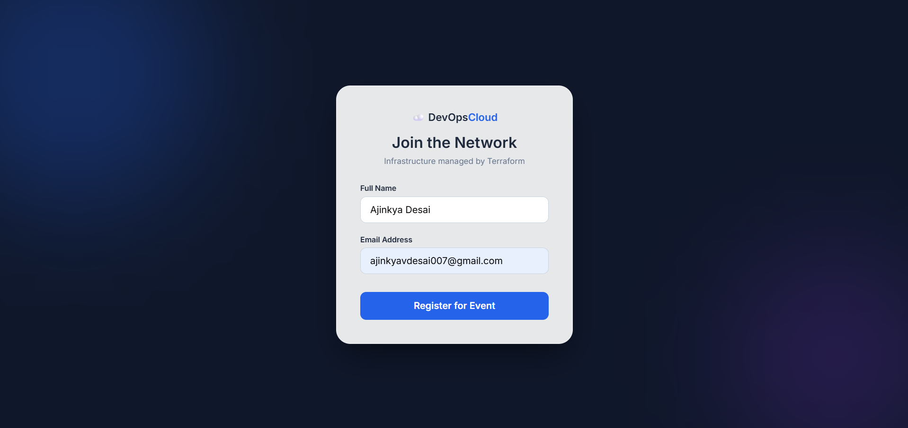
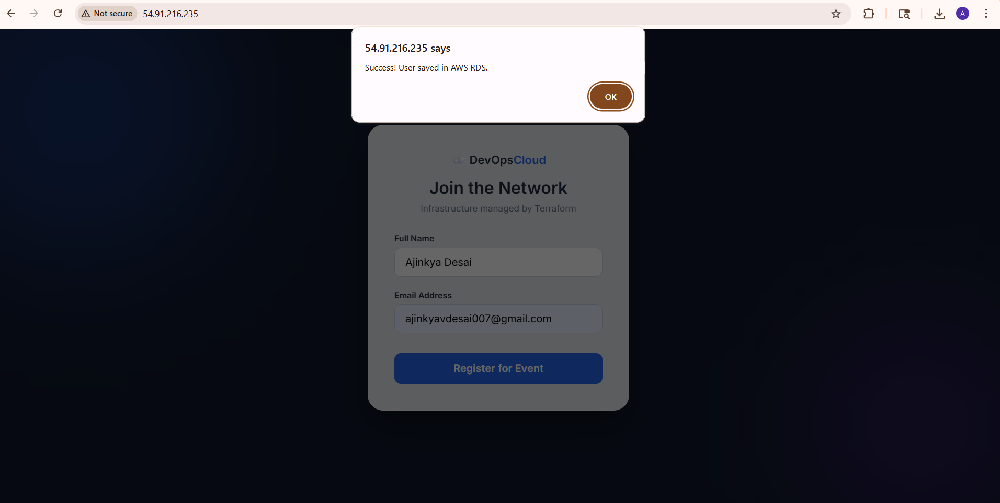

## End-to-End Automated Cloud Registration System: A Jenkins-Docker-AWS Pipeline

### Overview
Automated CI/CD pipeline using Jenkins and Docker to deploy a containerized Node.js application.
Provisions secure AWS RDS infrastructure via Terraform with encrypted database connectivity.

### Architecture

### App page

